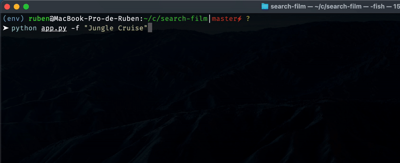

⚠️ PROGRAMME NON MAJ ⚠️

# Search film
C'est un programme qui retourne des liens pour visualier un film préalablement recherché.
## En quoi est-il utile ? 
Sa recherche est très simple, il suffit de taper le nom du film que vous voulez visualiser, et le programme retourne les liens pour visualiser le film. :mag:  
Ces liens proviennent de différents sites de streaming, cela permet d'avoir un accès à toutes les qualités disponibles. :sparkles:  
De plus il permet de visualiser un film en ligne sans avoir à passer par un site de streaming. :eyes:  

## Comment utiliser le script ?
Il faut au préalable python version 3.9.x d'installé.  
1) La première étape consiste à installer les librairies nécessaires à sont éxécution.  
`pip install -r requirements.txt`  

2) Ensuite on peut lancer le script de 2 manières :
- Lancement nominal : `python app.py`  
- Lancement avec args : `python app.py [-f | --film] Matrix`  
  
La commande `python app.py -h` affiche l'ensemble des arguments possibles.  
## Exemple d'utilisation avec arguments
Recherche du film Matrix  
`python app.py -f Matrix`  

Recherche du film Jungle Cruise, ici nous avons un espace donc il nécessaire d'utiliser des quotes.  
`python app.py -f 'Jungle Cruise'`

Recherche du film Matrix et sauvegarde des résultats dans un fichier .txt  
Si ce fichier contient déjà des élements, alors la prochaine recherche s'ajoutera à la suite.  
`python app.py -s -f Matrix`  

Il est possible de lancer l'application en mode nominal et sauvegarder les résultats.  
`python app.py -s`  
